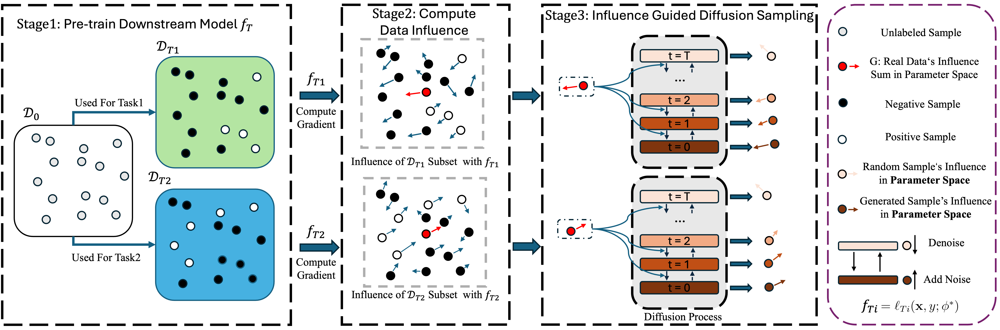

# TarDiff: Target-Oriented Diffusion Guidance for Synthetic Electronic Health Record Time Series Generation

  

## Introduction


Synthetic Electronic Health Record (EHR) time-series generation is crucial for advancing clinical machine learning models, as it helps address data scarcity by providing more training data. However, most existing approaches focus primarily on replicating statistical distributions and temporal dependencies of real-world data. We argue that fidelity to observed data alone does not guarantee better model performance, as common patterns may dominate, limiting the representation of rare but important conditions. This highlights the need for generate synthetic samples to improve performance of specific clinical models to fulfill their target outcomes. To address this, we propose TarDiff, a novel target-oriented diffusion framework that integrates task-specific influence guidance into the synthetic data generation process. Unlike conventional approaches that mimic training data distributions, TarDiff optimizes synthetic samples by quantifying their expected contribution to improving downstream model performance through influence functions. Specifically, we measure the reduction in task-specific loss induced by synthetic samples and embed this influence gradient into the reverse diffusion process, thereby steering the generation towards utility-optimized data. Evaluated on six publicly available EHR datasets, TarDiff achieves state-of-the-art performance, outperforming existing methods by up to 20.4% in AUPRC and 18.4% in AUROC. Our results demonstrate that TarDiff not only preserves temporal fidelity but also enhances downstream model performance, offering a robust solution to data scarcity and class imbalance in healthcare analytics.


## 1 · Environment

### Env
Prepare TarDiff's environment.
```
conda env create -f environment.yaml
conda activate tardiff
```

Prepare TS downstream task environment depands on the repo you used for the specific task.

## 2 · Data Pre-processing
You can download eICU dataset and MIMIC-III dataset from the link below:

**Note**: We only use the time series recorded in both two EHR dataset. We prepared our script for extracting ts data on these dataset for reference, you can check them in directory **data_preprocess**


## 3 · Stage 1 · Train the *Base* Diffusion Model

```bash
bash train.sh            # trains TarDiff on MIMIC-III ICU-stay data
```

> **Edit tip:** open the example YAML in `configs/base/` and replace any placeholder data paths with your own before running.

This step produces an unconditional diffusion model checkpoint—no guidance yet.

---

## 4 · Stage 2 · Train a Downstream Task Model (Guidance Source)

An example RNN classifier is supplied in **`classifier/`**.

```bash
cd classifier
bash train.sh            # saves weights to classifier/checkpoint/
cd ..
```

Feel free to swap in any architecture that suits your task.

---

## 5 · Stage 3 · Target-Guided Generation

With **both** checkpoints ready—the diffusion backbone and the task model—start guided sampling:

```bash
bash generation.sh       # remember to update paths to both weights
```

The script creates a synthetic dataset tailored to the guidance task.

---

## 6 · Stage 4 · Utility Evaluation — *TSTR* and *TSRTR*

After generation you can quantify how useful the synthetic data really is for the **target task** in two complementary ways:

| Protocol | Train set | Test set | Typical question answered |
|----------|-----------|----------|---------------------------|
| **TSTR** (Train-Synthetic, Test-Real) | **Synthetic only** | **Real** | “If I publish only synthetic EHRs, how well does a model trained on them generalise to real patients?” |
| **TSRTR** (Train-Synthetic-Real, Test-Real) | **Synthetic + Real** (α ∈ {0.2,…,1.0}) | **Real** | “If I enlarge the real dataset with α× synthetic samples, do I gain extra accuracy?” |

---

Enjoy exploring target-oriented diffusion for healthcare ML!  For issues or pull requests, please open a GitHub ticket.
